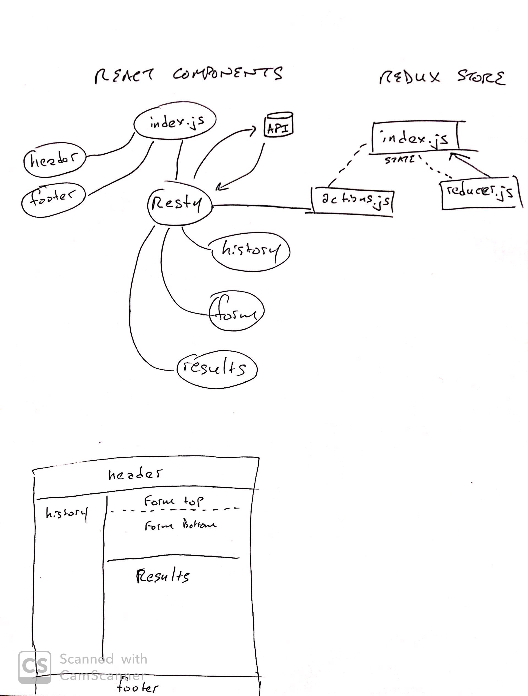

 LAB-35
=================================================

## Resty

### Author: Billy & Vanessa

### Links and Resources
* [repo](https://github.com/401d29-lab-35/lab-35)
* [netlify](https://billy-vanessa-resty.netlify.com/)

## Introduction
A simplify API development environment using redux store.


### Setup
#### `.env` requirements
* `npm i` install dependencies

#### Running the app
* `npm start`

### Components & modules
```
├── package-lock.json
├── package.json
├── public
│   └── index.html
├── scripts
│   ├── build.js
│   ├── start.js
│   └── test.js
└── src
    ├── app.js
    ├── components
    │   ├── footer
    │   │   └── index.js
    │   ├── header
    │   │   └── index.js
    │   └── resty
    │       ├── actions.js
    │       ├── form
    │       │   └── form.js
    │       ├── history
    │       │   └── history.js
    │       ├── index.js
    │       ├── reducers.js
    │       ├── resty.css
    │       └── results
    │           └── results.js
    ├── index.js
    ├── lib
    │   ├── api.js
    │   └── utils.js
    ├── store
    │   └── index.js
    └── style
        ├── reset.css
        └── style.css
```


#### UML
